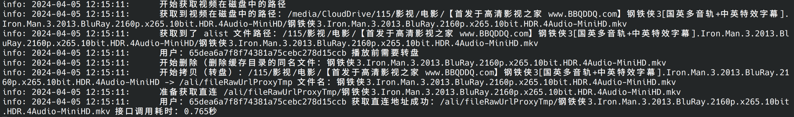

# Falco

> 1.0.0 (旧)版本 **<u>已停止维护</u>**，请使用新版(当前版本)。

## 下个版本计划
1. 用户与盘的映射配置过于麻烦，下个版本简化用用户名与盘进行映射
2. 提供多种转盘模式

## 功能

1. jellyfin、emby 直连播放。
2. 可以配置用户与盘的映射，在播放时，会自动根据用户与盘的映射，自动转盘然后进行直连播放（可防止阿里云盘单账号多IP访问封号的风险）。
3. 转盘产生的临时文件会自动删除，防止网盘空间不足。

## 搭建

### 1. 准备：alist挂载多个盘（拥有直连的盘，比如阿里云盘，115）

记得在alist盘配置中 **<u>开启秒传</u>**，**<u>移除方式改为删除（默认是回收站）</u>** 。

Q：为什么要把移除方式改为删除

A：因为本程序有自动对缓存目录进行清除的功能，只有在删除后才不会占用网盘空间。这样做是避免网盘在转存过多缓存后空间不足。

​​


### 2. 配置

#### 2.1 配置直连获取程序

找到 `config/config.yml`​​ 进行配置

```yml
# alist相关配置
alist:
  # alist的token
  token: alist-123
  # alist的地址
  address: http://172.17.0.1:5244

# emby相关配置
emby: 
  # emby地址
  address: http://172.17.0.1:8096
  # emby的令牌
  apiKey: 123
  # 磁盘映射目录。比如我emby有个电影的媒体库路径为 “/home/webdav/CloudDrive/115/电影”
  # 而“/115/电影”是我alist的路径，那么这里就填“/home/webdav/CloudDrive”
  mountPath: /home/webdav/CloudDrive

# 配置emby|jellyfin 用户与盘的映射
# 比如 de17fe7bbe6346a69155d8798c6f8909: /ali
# de17fe7bbe6346a69155d8798c6f8909 是emby，jellyfin用户的ID   ali为alist盘（暂时只支持一级目录）
userDiskContext:
  de17fe7bbe6346a69155d8798c6f8909: /ali
  e1955a18b7d64f6f95fdd2379ec79456: /ali01

```

**Q：如何获取emby|jellyfin用户的id？**

​​

​​

### 3. 启动

回到根目录（docker-compose.yml所在的目录）​ 执行下面命令进行启动

```sh
docker-compose up -d
```

可使用docker ps 查看这两个容器进行启动

也可通过进入 `/logs`​​ 目录 执行以下目录进行查看日志，可以看到目录下面有三个日志文件
```text
all.log     全部类型的日志，排查问题时看这个日志
info.log    正常类型的日志，一般我们会看这个日志
error.log   错误类型的日志，程序异常时查看这个日志
```

```sh
tail -f info.log
```
点击播放一个视频，你会看到



## 如何使用

在连接时使用 **<u>8095</u>**  的端口即可
