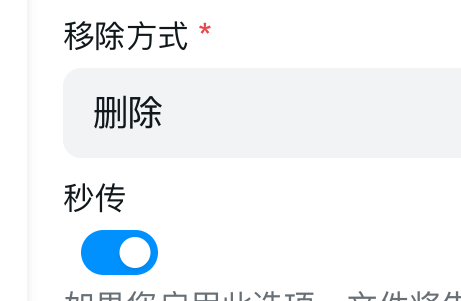
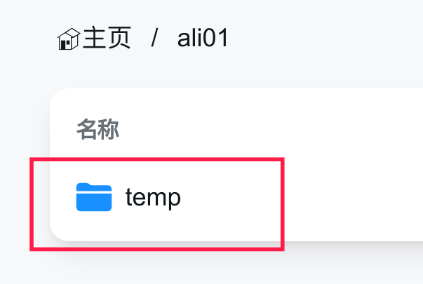
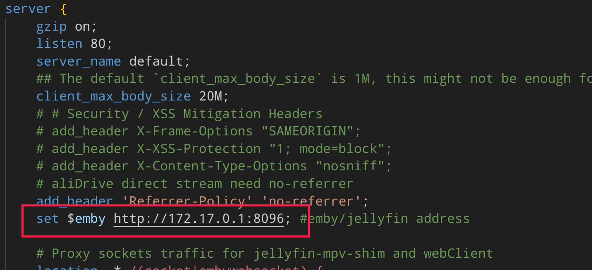
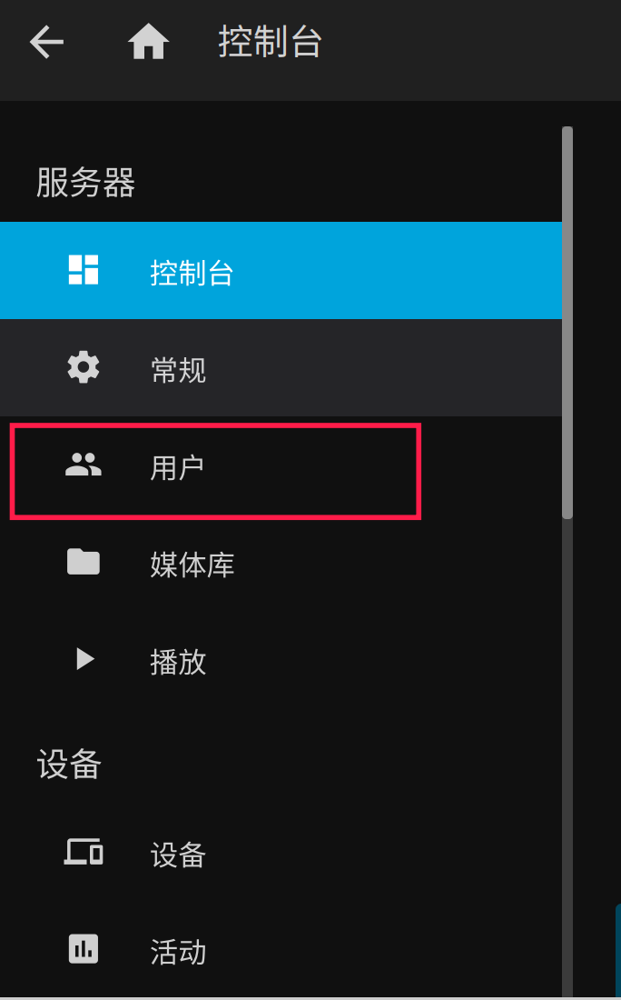
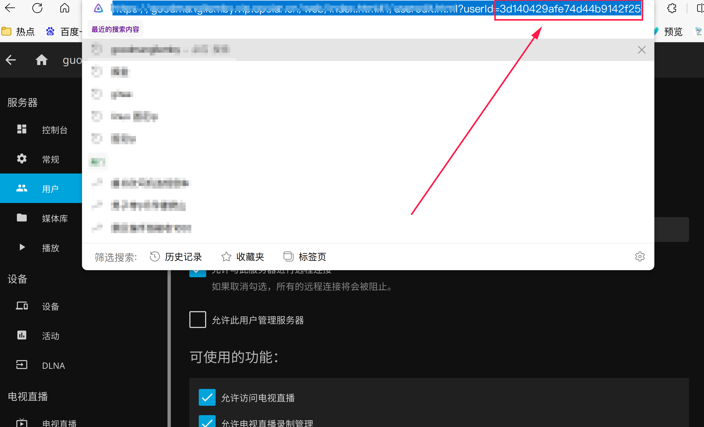
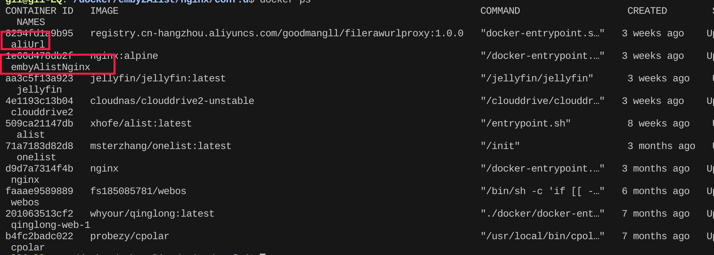
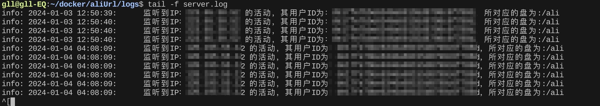

# jellyfin、emby 直连（防封号）

## 功能

1. jellyfin、emby中的每个用户绑定alist中的盘
2. 在用户播放时把对应的视频拷贝到对应用户所绑定的alist的盘的缓存目录中（如果该用户对应的盘为视频所在的盘则不会转盘），然后再获取直连

## 搭建

### 1. 准备：alist挂载多个盘（拥有直连的盘，比如阿里）

记得在alist盘配置中 **<u>开启秒传</u>**，**<u>移除方式改为删除（默认是回收站）</u>** ，**<u>并在每个盘的根目录下建一个 temp 目录</u>**

Q：为什么要把移除方式改为删除

A：因为本程序有自动对缓存目录进行清除的功能，只有在删除后才不会占用网盘空间。这样做是避免网盘在转存过多缓存后空间不足。

​​

​​

### 2. 配置：解压压缩包，进行配置

#### 2.1 配置nginx（基本上不需要改）

找到 `/raw-url-manager/emby2Alist/nginx/conf.d/emby.conf`​ 并编辑

把`http://172.17.0.1:8096`​ 改为自己本机的emby地址。一般都是这个地址。

> ​`172.17.0.1`​ 是 Docker 在本地机器上为自己分配的网桥地址。在默认情况下，Docker 会创建一个名为 `docker0`​ 的网桥，并分配 `172.17.0.1/16`​ 这个网段作为该网桥的 IP 地址。**<u>其他容器可以通过这个 IP 地址来访问主机上运行的服务</u>**

​​​​

#### 2.2 配置直连获取程序

找到 `/raw-url-manager/fileRawUrlProxy/config.yml`​​ 进行配置

```yml
# alist相关配置
alist:
  # alist的token
  token: alist-123
  # alist的地址
  address: http://172.17.0.1:5244

# emby相关配置
emby: 
  # emby地址
  address: http://172.17.0.1:8096
  # emby的令牌
  apiKey: 123
  # 磁盘映射目录。比如我emby有个电影的媒体库路径为 “/home/webdav/CloudDrive/115/电影”
  # 而“/115/电影”是我alist的路径，那么这里就填“/home/webdav/CloudDrive”
  mountPath: /home/webdav/CloudDrive

# 配置emby|jellyfin 用户与盘的映射
# 比如 de17fe7bbe6346a69155d8798c6f8909: '/ali'
# de17fe7bbe6346a69155d8798c6f8909 是emby|jellyfin用户的ID   ali为alist盘
userPanContext:
  de17fe7bbe6346a69155d8798c6f8909: /ali
  e1955a18b7d64f6f95fdd2379ec79456: /ali01

```

**Q：如何获取emby|jellyfin用户的id？**

​​

​​

### 3. 启动

回到根目录 `/raw-url-manager`​ 执行下面命令进行启动

```sh
docker-compose up -d
```

可使用docker ps 查看这两个容器进行启动

​​

也可通过进入 `/raw-url-manager/fileRawUrlProxy/logs`​​ 目录 执行以下目录进行查看日志

```sh
tail -f server.log
```

​​

## 使用

在连接时使用 **<u>8095</u>**  的端口即可
